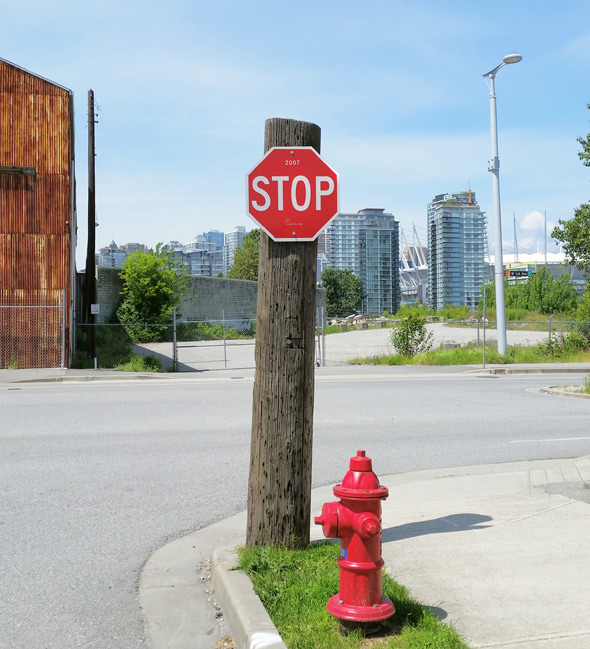

# :camera: :question: Visual-Question-Answering
Visual Question Answering Demo and Algorithmia API


### Requirements (Gereksinimler): 

* [Tensorflow (Ver. 1.2+)](https://www.tensorflow.org/install/pip)
* [Keras (Ver. 2.0+)](https://pypi.org/project/Keras/)
* [scikit-learn](https://scikit-learn.org/stable/install.html)
* [Spacy (Ver 2.0+)](https://spacy.io/usage/)
    * Used to load Glove vectors (word2vec)
    * To upgrade & install Glove Vectors
       * python -m spacy download en_vectors_web_lg
       
* [OpenCV](https://pypi.org/project/opencv-python/)

### Blog 📝

Görsel soru cevaplama ile ilgili anlatım ve bu görev için sıklıkla kullanılan veri kümeleri hakkında detaylı bilgi edinmek için ["Çok Gören Mi Bilir, Çok Soran Mı?"](https://medium.com/deep-learning-turkiye/%C3%A7ok-g%C3%B6ren-mi-bilir-%C3%A7ok-soran-m%C4%B1-4bed5efdba41) başlıklı blog yazıma göz atabilirsiniz.

You can browse my blog titled ["Çok Gören Mi Bilir, Çok Soran Mı?"](https://medium.com/deep-learning-turkiye/%C3%A7ok-g%C3%B6ren-mi-bilir-%C3%A7ok-soran-m%C4%B1-4bed5efdba41) to get detailed information about the Visual Question Answering and the datasets frequently used for this task.

### Demo 🖥️

[](https://colab.research.google.com/github/basakbuluz/Visual-Question-Answering/blob/master/VisualQuestionAnsweringDemo.ipynb)

[Bu jupyter notebook çalışma dosyası](https://nbviewer.jupyter.org/github/basakbuluz/Visual-Question-Answering/blob/master/VisualQuestionAnsweringDemo.ipynb), verilen görüntü hakkında sorulan soruyu cevaplamak için önceden hazırlanmış modelleri kullanan basit bir Görsel Soru Cevaplama demosudur.

[This jupyter notebook](https://nbviewer.jupyter.org/github/basakbuluz/Visual-Question-Answering/blob/master/VisualQuestionAnsweringDemo.ipynb) is a simple Visual Question answering demo that uses pretrained models to answer a given question about the given image.

### API :computer:

Geliştirdiğiniz ürünlere hızlı bir şekilde entegre edebileceğiniz API'yi kullanmak için [buraya](https://algorithmia.com/algorithms/yavuzkomecoglu/VQA) tıklayın.

[Click here](https://algorithmia.com/algorithms/yavuzkomecoglu/VQA) to use the API that you can integrate quickly into the products you have developed.

##### API Python Implementation
###### Install
Install the Algorithmia Python client with pip:

```
pip install algorithmia
```

###### Use
```
import Algorithmia

input = {
  "image": "data://yavuzkomecoglu/DL_VQA/test.jpg",
  "question": "What vehicle is in the picture?"
}
client = Algorithmia.client('YOUR_API_KEY')
algo = client.algo('yavuzkomecoglu/VQA/0.1.1')
print(algo.pipe(input).result)
```

### Sample predictions (Örnekler)
VQA modeli tarafından tahmin edilen bazı cevaplar.

Some answers predicted by the VQA model.


Q: How is the weather? 
A: Sunny! (%97.23)


Q: What is done in the picture?
A: Surfing! (%99.43)



Q: What does the sign say?
A: Stop! (%28.61)

### References

* [Aaditya Prakash (Adi) - Blog](https://iamaaditya.github.io/2016/04/visual_question_answering_demo_notebook)
